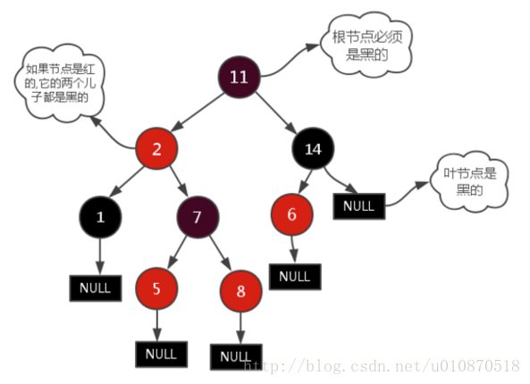

# 数据库索引
> 参考：[AVL树、红黑树、B(B-)树、B+树](https://blog.csdn.net/xlgen157387/article/details/79450295)

> 参考：[为什么数据库索引使用B+树而非红黑树或B-树](https://www.cnblogs.com/aspirant/p/9214485.html)


## AVL树
AVL树是一种强平衡二叉树

产生场景：一般来说，二叉树的平均查找速度会比顺序查询的速度更快，所以二叉树的数据结构适用于查询场景。但是，极端情况下，比如根节点是最小或最大的数，那么二叉树就会退化成线性链路结构，查询速度就和顺序查询差不多。因此，若想构造一个最大性能的二叉查找树，则需设计一颗平衡的二叉树。

AVL树是严格的平衡二叉树（平衡：左右子树树高不超过1）。一般用平衡因子差值判断是否平衡，若不平衡则通过旋转来实现平衡。


局限性：一旦执行插入/删除操作后导致树变得不平衡，就需要通过旋转来保持平衡。而树的旋转是非常耗时的，导致维护这种高度平衡所付出的代价，比从中获得的效益还要大，实际适用场景有限。

AVL树适合于插入/删除次数不频繁，但查询比较多的情况。Windows NT内核中广泛存在AVL树。


## 红黑树
红黑树是一种弱平衡二叉树。每个节点非红即黑，每条路径都包含相同的黑节点数。通过这种对节点着色方式的限制，红黑树确保没有一条路径会比其它路径长出两倍。



相对于严格平衡的AVL树，相同节点下，红黑树的高度更大，但是其旋转次数更少。因此，红黑树适用于搜索、插入、删除操作都比较多的情况下。

红黑树应用：Java的TreeMap实现；C++的Map、Set实现；I/O多路复用epoll的实现等。

## B树（B-树）
B树，也就是B-树，是一种平衡多叉树。

```
B-tree, not to be confused with Binary Tree!

B树，与二叉树无关，B数是多叉树，全称是平衡多路查找树。
```

1. 每个节点可存储多个关键字key（即索引），即每个key对应的数据指针（即数据的实际存储地址）

2. 非叶子结点的关键字个数 = 指向儿子节点的指针个数 - 1

3. B树不允许各个节点中的关键字重复

4. 关键字key在B树中的排序规则如图所示


### **为什么数据库索引使用B类树而非红黑树？**

索引文件是存储于磁盘中的，由于索引文件通常比较大，无法一次全部加载到内存中。因此，每次只能从磁盘中读取一个磁盘页的数据到内存中。而磁盘速度相比内存速度差了好几个级别，所以实际中采用磁盘预读机制。

> `磁盘预读`：磁盘的存取速度往往只有主存的几百分之一，因此为了提高效率，要尽量减少磁盘I/O。为了达到这个目的，磁盘往往不是严格按需读取，而是每次都会预读。即使只需要一个字节，磁盘也会从这个位置开始，顺序向后读取一定长度的数据放入内存。这样做的理论依据是计算机科学中著名的 `局部性原理：当一个数据被用到时，其附近的数据通常也会马上被使用。`

红黑树由于只能二分叉，树高会比较深，逻辑上很近的节点物理上可能很远，因此无法利用局部性原理。也就是说，使用红黑树（平衡二叉树）的话，每次磁盘预读的很多数据是用不上的。因此，红黑树没能利用好磁盘预读功能，同时又由于深度较大，所需的磁盘IO操作也会更多。

相比红黑树，B树则是为了充分利用磁盘预读功能而创建的一种数据结构。也就是说，树就是为了用作数据库索引才被发明出来的：

1）将B树的一个节点大小设置为一个磁盘页的大小，则可充分利用磁盘预读的功能。即每次读取一个磁盘页时，就会读取一整个节点。

2）同时，B树由于是多分叉，每个节点可以存储比较多的关键字，树的深度就会比较小，从而需要执行的磁盘IO操作次数也比较少（更多的是在内存中对读取进来的数据进行查询）。

B树的查询，主要发生在内存中，而红黑树的查询，则主要是磁盘读取。因此，虽然B树的查询次数不比红黑树少，但是相比磁盘IO速度，内存的查询耗时就可以忽略不计了。因此，B树比红黑树更适合作为数据库索引。


## B+树
B+树是B树的变形树，也是一种平衡多叉树。

1. B+树的设计思路，是应文件系统的存储结构而生的。文件系统中，文件目录是一级一级的索引，一直到最底层的文件夹中才保存真正的数据。因此，B+树的非叶子节点只保存索引，不保存实际的数据或指针；实际数据或指针都保存在叶子节点中。换句话说，B+树的非叶子节点仅用作索引，而叶子节点中则包含所有关键字key和key对应的数据或指针。

2. B+树的叶子节点中，有一个指针指向下一个叶子节点。这个设计是为了提高区间访问（范围查询）的性能。

3. 非叶子节点的关键字个数 = 指向儿子节点的指针个数 

4. B+树允许各个节点中的关键字重复

5. 关键字key在B+树中的排序规则如图所示


### ** 数据库索引使用B+树比B树有什么好处？**

1. B+树相比B树，有一个很大的好处：方便扫库。

B树必须用中序遍历的方法才能按顺序扫库，而B+树由于每个叶子节点中都有指向下一个叶子节点的指针，所以在查找到最小的叶子结点后，直接顺着叶子节点往后挨个扫过去就可以。

也就是说，B+树支持范围查询（range-query）非常方便，而B树则效率低下。这是数据库选用B+树的最主要原因。

> B树在提高了磁盘IO性能的同时并没有解决元素遍历效率低下的问题，为了解决这个问题，B+树应运而生。因为数据库中基于范围的查询是非常频繁的，B+树只要遍历叶子节点就可以实现整棵树的遍历，而B树不支持这样的操作，或者说效率太低。

2. B+树的磁盘读写代价更低。

B树的每个节点中除了存储关键字外，还需存储关键字对应的数据/指针。而B+树的节点只需存储索引，不需存储对应的具体数据/指针。因此，B+树的一个节点中可存放的关键字相比B树更多，从而磁盘IO的读写次数也就降低了。

3. B+树的查询效率更加稳定。

由于B+树中非叶子结点只是叶子结点中关键字的索引，所以任何查询必须走一条从根结点到叶子结点的路，即所有关键字的查询路径长度相同，因此每一个数据的查询效率相当。而B树因为每个节点中既存储关键字，又存储具体的数据/指针，因此每次查询需要一次中序遍历，查询效率不一。
